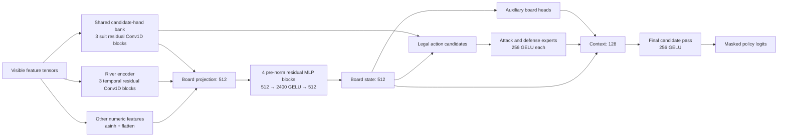

# Nejimakidori model card

This is the active model contract and training runbook. Dated measurements and
audit evidence belong in [the audit archive](../nejimakidori-audits/README.md).

## Features

The actor consumes only declared visible-game tensors. The complete typed
schema is [FeatureVector](feature_vector.py); packing from replay state is
[features.pack](model/features.py). Policy legality is recomputed by
[decision_layers.legal_choices](model/decision_layers.py).

| Family | Definition | Code |
| --- | --- | --- |
| Candidate hands | Up to 96 legal candidate hands with tile counts, red-five identity, melds, validity, and each action's selected candidate. | [Schema](feature_vector.py), [packing](model/features.py) |
| Public table | Rivers with timing/call/riichi/dora metadata; melds; dora; visible and unavailable tiles; scores, seats, round, wall, deposits, and kan state. | [Schema](feature_vector.py), [packing](model/features.py) |
| Self-hand structure | Normal, chiitoitsu, and kokushi shanten; efficiency; yaku possibility; current draw; and closed-hand state. | [Schema](feature_vector.py), [packing](model/features.py) |
| Opponent danger | Open-hand yaku possibility, discard/call counts, genbutsu, blockers, and sotogawa timing. | [Schema](feature_vector.py), [packing](model/features.py) |
| Per-action structure | Legal masks plus discard/call/kan shanten, ukeire, upgrades, yaku possibility, completion, tenpai values, and retained genbutsu. | [Schema](feature_vector.py), [packing](model/features.py) |

Labels may use concealed future state; actor inputs may not. The serialized
producer/consumer contract is [records.py](model/records.py).

## Focused-training selection

The focused phase filters to records marked `meta/focused`; it does not
reweight the remaining records. The marker is assigned by
[retain_focused](log_dataset/rebuild.py) and applied by
[records.dataset](model/records.py).

An observation is selected when it is a riichi decision, a chi or pon response,
or a non-tsumogiri discard with a threat, late-wall/South context, or a
qualifying whole-hand yaku-tenpai/tedashi/dora case. Kan alone, ordinary call
passes, and ordinary tsumogiri are excluded. The canonical rules and thresholds
are `FOCUSED_SAMPLING` in [records.py](model/records.py).

## Objectives

All losses are masked to valid labels and reduced consistently across replicas
by [objectives.py](model/objectives.py). Their composition is
[GroupedModel.loss_terms](model/train.py).

| Group | Definition | Code |
| --- | --- | --- |
| Actor imitation and entropy | Cross-entropy over legal observed discard, riichi, response, and kan actions, with entropy regularization on active legal policies. | [policy terms](model/objectives.py), [composition](model/train.py) |
| Offline payoff | Placement-residual and signed-log honba-free point critics train AWR actor regression. Placement and dealership-point advice are separate. | [offline payoff](model/objectives.py), [composition](model/train.py) |
| Board supervision | Opponent shanten/ukeire/hand counts, terminal payments, completion yaku, round placement, and final placement train shared board representations. | [losses](model/train.py), [targets](model/records.py) |
| Attack and defense specialists | Candidate-specific receipt, deal-in, tenpai, tenpai value, sakigiri, and regret supervision; each specialist combines imitation, AWR, and regret. | [specialist loss](model/train.py), [targets](model/records.py) |

Authoritative group weights, entropy coefficient, and payoff ramp are in
[objectives.py](model/objectives.py); resolved values are written to
`candidate/run_config.json`.

## Architecture



The shared candidate encoder, river encoder, candidate construction, and final
fusion are in [decision_layers.py](model/decision_layers.py). The actor and
output heads are in [model.py](model/model.py). Training-only payoff and
specialist baselines/critics wrap the actor in [train.py](model/train.py).

## Training parameters

| Parameter | Value | Code |
| --- | --- | --- |
| Devices | GPUs 1–4; GPU 0 remains production. | [entry point](train.py) |
| Total exposure | 1,540,362,240 requested positions, rounded down to complete batches. | [trainer](model/train.py) |
| Batch | 5,120 total; 1,280 per GPU. | [trainer](model/train.py) |
| Phase schedule | Natural 25% → focused 50% → natural 25%. | [trainer](model/train.py) |
| Optimizer | AdamW; weight decay 1e-4, epsilon 1e-6, global clip norm 1. | [trainer](model/train.py) |
| Learning rate | Peak 2e-4; 2% warmup from 10% of peak, hold to 75%, then cosine decay to 10% of peak. | [schedule](model/train.py) |
| Precision and memory | Mixed bfloat16; 23,552 MiB logical limit per GPU. | [trainer](model/train.py) |
| Payoff ramp | Coefficient 0 through 10% of updates, linear ramp to 2 by 60%. | [objectives](model/objectives.py) |
| Dealership advice | 0.25 by default; set by `--dealership-advice-strength`. | [entry point](train.py), [trainer](model/train.py) |
| Checkpoints | Best complete-action imitation accuracy per phase over 100-update windows; 30-minute global save cooldown. | [TopCheckpoints](model/train.py) |

## Runbook

Run from the repository root using the shared environment:

```sh
/home/fen/projects/codex_env/qrow/bin/python train.py \
  --root RUN --reference REFERENCE --data DATA
```

Use `--archives ARCHIVES` instead of `--data DATA` to rebuild records before
training. `--experiment` runs the fixed smoke recipe: two archived games when
building records, one worker, GPU 1, batch size four, two natural updates, four
focused updates, two final natural updates, and four evaluation games. It
checks execution rather than playing strength.

Every run starts a new model and optimizer. `plan.json` records the source and
reference; `candidate/run_config.json` records the resolved recipe; the final
actor is saved as `model.keras` and exported as `saved_model/`. The supported
arguments and pipeline order are [train.py](train.py); trainer behavior is
[model/train.py](model/train.py).
