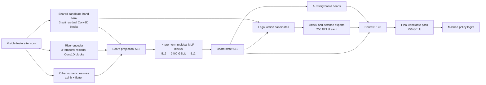

# Nejimakidori model card

Current training actions are tile classes: 37 discards and 74 dama/riichi
choices. Karagiri and tsumogiri are the same action. Recorded origin is a
separate `discard_origin` auxiliary label and still controls tedashi-only
focused sampling. Rebuild cached labels, selection, and TFRecords for this
contract; old checkpoints/exports require their frozen source. See
[payment critic contract](model/PAYMENT_CRITIC.md).

This is the active model contract and training runbook. Dated measurements and
audit evidence belong in [the audit archive](../notes/nejimakidori/audits/README.md).

The active joint trainer combines imitation, current-hand payment prediction
and retained auxiliary losses through a shared encoder. See the
[joint training contract](model/PAYMENT_CRITIC.md). Full training uses detached uncertainty-aware ST3 AWR and half the production
position exposure. Natural/focused/natural phases retain 0.5/4/0.5 pass
proportions within that fixed budget; this is not a newly deployed policy.
The architecture and
`GroupedModel` objective below describe an earlier actor retained for comparison.

## Features

The actor consumes only declared visible-game tensors. The complete typed
schema is [FeatureVector](feature_vector.py); packing from replay state is
[features.pack](model/features.py). Policy legality is recomputed by
[decision_layers.legal_choices](model/decision_layers.py).

| Family | Definition | Code |
| --- | --- | --- |
| Candidate hands | Up to 96 legal candidate hands with tile counts, red-five identity, melds, validity, and each action's selected candidate. | [Schema](feature_vector.py), [packing](model/features.py) |
| Public table | Rivers with timing/call/riichi/dora metadata; melds; dora; visible and unavailable tiles; scores, seats, round, wall, deposits, and kan state. | [Schema](feature_vector.py), [packing](model/features.py) |
| Self-hand structure | Normal, chiitoitsu, and kokushi shanten; efficiency; yaku possibility; current draw; and closed-hand state. | [Schema](feature_vector.py), [packing](model/features.py) |
| Opponent danger | Open-hand yaku possibility, discard/call counts, genbutsu, passed tiles with unchanged hands, blockers, and sotogawa timing. | [Schema](feature_vector.py), [packing](model/features.py) |
| Per-action structure | Legal masks plus discard/call/kan shanten, ukeire, upgrades, yaku possibility, completion, tenpai values, and retained genbutsu. | [Schema](feature_vector.py), [packing](model/features.py) |

Labels may use concealed future state; actor inputs may not. The serialized
producer/consumer contract is [records.py](model/records.py).

`passed_unchanged_to_seat[relative_seat, tile]` marks resolved discards by
other players since that seat's last hand discard, call, or kan. Tsumogiri
preserves this evidence; an unresolved discard is excluded. It is a learned
safety signal, not guaranteed genbutsu: players can decline ron. It enters
the actor's tile context and critic's public context without changing the
critic's hard genbutsu mask. New training records and a newly trained export
are required; existing frozen releases retain their original input contract.

`riichi_push_count[pusher, riichi_seat]` counts non-tsumogiri discards
that were not genbutsu against that riichi seat when discarded. Both axes
use relative seats. Counting starts at riichi acceptance and resets each
hand; multiple riichi threats have separate columns. Later safe discards
do not retroactively erase earlier pushes. Red and ordinary fives share
safety. The actor and payment critic receive this as learned threat evidence,
not proof of tenpai or a hard discard restriction. This also requires new
training records and a newly trained export.

## Focused-training selection

The focused phase filters to records marked `meta/focused`; it does not
reweight the remaining records. The marker is assigned by
[retain_focused](log_dataset/rebuild.py) and applied by
[records.dataset](model/records.py).

All actual chi/pon/open-kan and own-kan actions, riichi/dama decisions,
tenpai decisions, choices reaching tenpai, and late-wall one-shanten fights
are retained. Own yaku labels and opponent two-call yaku patterns retain
non-discard decisions and tedashi. Broader threat, late-match, and dora
contexts retain tedashi. Qualifying categories have 100% retention; ordinary
passes and tsumogiri enter only through qualifying critical categories.
The canonical rules are `FOCUSED_SAMPLING` in [records.py](model/records.py).
Rebuild records and selection metadata for the new training label contract.

## Objectives

All losses are masked to valid labels and reduced consistently across replicas
by [objectives.py](model/objectives.py). Their composition is
[GroupedModel.loss_terms](model/train.py).

| Group | Definition | Code |
| --- | --- | --- |
| Actor imitation and entropy | Cross-entropy over legal observed discard, riichi, response, and kan actions, with entropy regularization on active legal policies. | [policy terms](model/objectives.py), [composition](model/train.py) |
| Offline payoff | Placement-residual and signed-log honba-free point critics train AWR actor regression. Placement and dealership-point advice are separate. | [offline payoff](model/objectives.py), [composition](model/train.py) |
| Board supervision | Opponent shanten/ukeire/hand counts, terminal payments, completion yaku, round placement, and final placement train shared board representations. | [losses](model/train.py), [targets](model/records.py) |
| Attack and defense specialists | Candidate-specific receipt, deal-in, tenpai, tenpai value, sakigiri, and regret supervision; each specialist combines allocated imitation, global entropy, and regret. Final-imitation branch gradients follow the same allocation; specialist AWR is removed. | [specialist loss](model/train.py), [targets](model/records.py) |

Authoritative group weights, entropy coefficient, and payoff ramp are in
[objectives.py](model/objectives.py); resolved values are written to
`candidate/run_config.json`.

## Architecture


```mermaid
flowchart LR
    I[Visible feature tensors] --> H[Shared candidate-hand bank\n3 suit residual Conv1D blocks]
    I --> R[River encoder\n3 temporal residual Conv1D blocks]
    I --> N[Other numeric features\nasinh + flatten]
    H --> B[Board projection: 512]
    R --> B
    N --> B
    B --> RB[4 pre-norm residual MLP blocks\n512 → 2400 GELU → 512]
    RB --> S[Board state: 512]
    H --> C[Legal action candidates]
    S --> C
    S --> A[Auxiliary board heads]
    C --> X[Attack and defense experts\n256 GELU each]
    A --> F[Context: 128]
    X --> F
    S --> F
    F --> P[Final candidate pass\n256 GELU]
    P --> O[Masked policy logits]
```

The shared candidate encoder, river encoder, candidate construction, and final
fusion are in [decision_layers.py](model/decision_layers.py). The actor and
output heads are in [model.py](model/model.py). Training-only payoff
baselines/critics wrap the actor in [train.py](model/train.py).

The experimental `build_model(hand_board_context=True)` option gives each
resulting hand the visible board before the hand encoder's first GELU.
Tile-aligned dora, unavailable counts, blockers, and safety information join
the hand's tile channels. A linear map of the remaining board inputs joins
the same first affine operation; the board is not compressed through a
separate nonlinear encoder first. Suit reuse is restricted to one board.
This option uses the existing input/output contract and is disabled by default.
The `hand_board` critic experiment uses observed-outcome supervision and the
same payoff head as the `hand_control` experiment.

## Earlier actor comparator training parameters

The active joint trainer uses the half-exposure schedule in
[PAYMENT_CRITIC.md](model/PAYMENT_CRITIC.md). The table below describes
the retained `model.train` comparator.

| Parameter | Value | Code |
| --- | --- | --- |
| Devices | GPUs 1–4; GPU 0 remains production. | [entry point](train.py) |
| Total exposure | 1,540,362,240 requested positions, rounded down to complete batches. | [trainer](model/train.py) |
| Batch | 5,120 total; 1,280 per GPU. | [trainer](model/train.py) |
| Phase schedule | Natural 25% → focused 50% → natural 25%. | [trainer](model/train.py) |
| Optimizer | AdamW; weight decay 1e-4, epsilon 1e-6, global clip norm 1. | [trainer](model/train.py) |
| Learning rate | Peak 2e-4; 2% warmup from 10% of peak, hold to 75%, then cosine decay to 10% of peak. | [schedule](model/train.py) |
| Precision and memory | Mixed bfloat16; 23,552 MiB logical limit per GPU. | [trainer](model/train.py) |
| Payoff ramp | Coefficient 0 through 10% of updates, linear ramp to 2 by 60%. | [objectives](model/objectives.py) |
| Dealership advice | 0.25 by default; set by `--dealership-advice-strength`. | [entry point](train.py), [trainer](model/train.py) |
| Checkpoints | Best complete-action imitation accuracy per phase over 100-update windows; 30-minute global save cooldown. | [TopCheckpoints](model/train.py) |
| Critic validation | Five percent of complete games held out; 4,096 sampled positions evaluated every 2,000 updates. Compare recorded-action MSE with the prior, learned state baseline, and policy-averaged action values. | [partition](model/records.py), [metrics](model/objectives.py), [trainer](model/train.py) |

Beating the prior establishes outcome-prediction signal. Comparing the recorded
action with the policy average checks whether distinguishing actions adds
predictive information. These observational checks do not establish stronger
play; that requires game evaluation. Placement and point critics are reported
separately.

## Runbook

Run from the repository root using the shared environment:

```sh
/home/fen/projects/codex_env/qrow/bin/python train.py \
  --root RUN --reference REFERENCE --data DATA
```

Use `--archives ARCHIVES` instead of `--data DATA` to rebuild records before
training. `--experiment` runs the fixed smoke recipe: two archived games when
building records, one worker, GPU 1, batch size four, two natural updates, four
focused updates, two final natural updates, and four evaluation games. It
checks execution rather than playing strength.

Every run starts a new model and optimizer. `plan.json` records the source and
reference; `candidate/run_config.json` records the resolved recipe; the final
actor is saved as `model.keras` and exported as `saved_model/`. The supported
arguments and pipeline order are [train.py](train.py); trainer behavior is
[model/train.py](model/train.py).

The experimental [unified payment critic](model/PAYMENT_CRITIC.md) replaces
overlapping value predictions with one action-conditioned payment distribution
and separate scoring-bonus factors. Its bounded tests have not yet shown a
held-out action-value advantage; it is not the deployed model.
